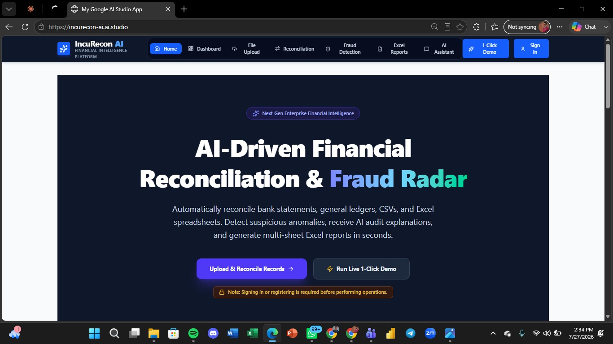

# IncuRecon AI
### AI-Powered Financial Reconciliation & Forensic Audit Platform

> **Automating Financial Reconciliation. Explaining Exceptions. Building Trust with AI.**

IncuRecon AI is an AI-powered financial intelligence platform, built during the **AI NOW Bootcamp Hackathon**, that reconciles transactions across bank statements, general ledgers, and supporting financial documents — then uses generative AI to explain *why* each exception happened, not just that it happened.

<div align="center">



</div>

🔗 **Live demo:** [incurecon-ai.ai.studio](https://incurecon-ai.ai.studio/)

---

## Table of Contents

- [The Opportunity](#the-opportunity)
- [Why Not Excel?](#why-not-excel)
- [Why Not QuickBooks, Xero, or Sage?](#why-not-quickbooks-xero-or-sage)
- [Investor FAQ: Security, Safety & Accuracy](#investor-faq-security-safety--accuracy)
- [Key Features](#key-features)
- [AI Architecture](#ai-architecture)
- [Tech Stack](#tech-stack)
- [Target Users](#target-users)
- [Responsible AI](#responsible-ai)
- [Status & Roadmap](#status--roadmap)
- [Getting Started (Technical)](#getting-started-technical)
- [Team](#team)
- [Contact](#contact)

---

## The Opportunity

Every month, finance teams lose real time to a workflow that hasn't changed in decades:

- Comparing bank statements against internal ledgers, line by line
- Manually investigating every unmatched transaction
- Trying to spot duplicate or suspicious entries by eye
- Assembling reconciliation reports for auditors from scratch
- Maintaining compliance documentation on top of all of it

Traditional reconciliation tools stop at *flagging* a discrepancy — they leave the finance professional to manually investigate the cause. IncuRecon AI goes further: it reconciles automatically, flags exceptions, and then **explains** them in plain language, backed by the underlying transaction evidence.

---

## Why Not Excel?

Excel is the incumbent because it's free, flexible, and universal — not because it's good at this specific job. Reconciliation in Excel is manual formula-matching, re-verified by a human, every cycle, for every file.

| | Excel / Spreadsheets | IncuRecon AI |
|---|---|---|
| Matching logic | Manual formulas, exact-text lookups | Automated matching across amount, date, reference, and description, using rule-based financial logic |
| Exception handling | Reviewer has to notice and investigate manually | Automatically flags duplicates, missing entries, suspicious transactions, and high-risk patterns |
| Explanation of exceptions | None | AI-generated, evidence-backed explanation for *why* a transaction didn't reconcile |
| Audit trail | Ad hoc, whatever the analyst remembers to document | Structured, audit-ready reconciliation report generated automatically |
| Auditor support | None | Built-in AI assistant that answers auditor questions and summarizes findings |

Excel isn't a bad tool — reconciliation was just never its job. It's a canvas, not a control system.

---

## Why Not QuickBooks, Xero, or Sage?

Established accounting suites are **bookkeeping systems of record** — excellent at invoicing, ledgers, payroll, and basic bank feeds. Reconciliation inside them is typically a simple transaction match against a live bank feed, not a fraud-aware, explainable, cross-document reconciliation engine. IncuRecon AI isn't trying to replace the ledger of record — it's the **specialized reconciliation and forensic audit layer** that sits on top of whatever accounting system a business already uses, and it works across PDF bank statements, CSVs, and Excel ledgers rather than requiring both sides to already live in one platform.

Key differences:

- **Explainability:** Reconciliation mismatches in most accounting software surface as a raw diff. IncuRecon AI's AI assistant explains the exception, answers follow-up questions, and generates a reconciliation narrative an auditor can actually use.
- **Fraud-and-risk-first design:** Incumbent suites focus on categorization and bookkeeping accuracy. IncuRecon AI is built specifically to surface duplicate transactions, missing entries, suspicious activity, and high-risk patterns.
- **Document flexibility:** Reconciles PDF bank statements, CSVs, and Excel ledgers side by side, without requiring a live bank-feed integration first.
- **Audit-ready output by default:** Every reconciliation produces a structured report — summary, matched, unmatched, fraud indicators, AI explanations, and recommendations — rather than a raw transaction list.

---

## Investor FAQ: Security, Safety & Accuracy

### What stage is this at, honestly?
IncuRecon AI is currently an **MVP built during the AI NOW Bootcamp Hackathon** — not a production-hardened platform yet. It currently runs on local/mock storage rather than a production database, and multi-user authentication is a Phase 2 roadmap item, not a shipped feature. We'd rather be upfront about that with investors than overstate where the product is.

### How does the AI work, and where does our data go?
The AI assistant is powered by **Google Gemini**, accessed via API, combined with **Retrieval-Augmented Generation (RAG)** and **Sentence Transformers** for semantic search over transaction data. This means reconciliation explanations are grounded in your actual uploaded transaction data (not a generic model guess) — but it also means AI processing currently calls a third-party API (Google) rather than running fully on-premises. If self-hosted/local-model deployment is a requirement for a given customer (e.g. a bank or regulated institution), that's an architecture change we'd scope as part of an enterprise deployment, not something the current MVP does today.

### Does it store sensitive personal information?
The platform was designed with **no storage of sensitive personal information** as a core principle, alongside explainable AI responses, human-in-the-loop decision support, audit-friendly outputs, and transparent recommendations. That said, formal data handling policies, encryption-at-rest, and access controls appropriate for regulated finance customers are part of the production roadmap (Phase 2/3), not yet independently audited.

### How accurate is the matching and fraud detection?
Reconciliation uses deterministic rule-based logic across four dimensions — amount, date, reference, and description matching — so matches are inspectable, not a black box. Exception detection surfaces duplicate transactions, missing entries, suspicious transactions, high-risk patterns, and potential anomalies. As with any hackathon-stage MVP, we have not yet run formal precision/recall benchmarking against labeled fraud datasets — that's a near-term validation priority alongside broader pilot testing.

### What happens if the AI explanation is wrong?
Every AI output is a **human-in-the-loop decision support** tool by design — an explanation or recommendation for a person to evaluate, not an automatic ledger write. Because explanations are generated via RAG against the actual transaction data rather than the model's general knowledge, they're intended to be evidence-backed rather than guessed — but they should still be reviewed like any AI-assisted output.

### Is this dependent on Google's Gemini API long-term?
Today, yes — the AI assistant is built on Google Gemini. That's a reasonable MVP choice (fast to build, strong reasoning quality), but it does mean cost and availability are tied to Google's API pricing and uptime. Evaluating self-hosted/open-weight model alternatives would be a sensible question to revisit as the product matures past MVP stage.

---

## Key Features

### Financial Document Upload
- PDF bank statements
- CSV files
- Excel ledgers (.xlsx)
- Supporting financial documents

### Intelligent Reconciliation
Automatically matches transactions using amount matching, date matching, reference matching, description matching, and rule-based financial logic.

### Fraud & Risk Detection
Detects duplicate transactions, missing entries, suspicious transactions, high-risk patterns, and potential financial anomalies.

### AI Financial Assistant (Google Gemini)
- Explains reconciliation exceptions
- Answers auditor questions
- Summarizes financial findings
- Generates reconciliation narratives
- Provides evidence-backed explanations

### Audit-Ready Reports
Reconciliation summary, matched transactions, unmatched transactions, fraud indicators, AI explanations, and recommendations.

---

## AI Architecture

The AI pipeline combines deterministic finance logic with generative AI:

```text
                Upload Documents
                        │
                        ▼
             Document Processing
                        │
                        ▼
             Data Normalization
                        │
                        ▼
         Rule-Based Reconciliation
                        │
        Matched / Unmatched Records
                        │
                        ▼
          Fraud & Exception Detection
                        │
                        ▼
           Retrieval-Augmented Generation
                        │
                        ▼
                Google Gemini
                        │
                        ▼
    Explainable AI + Audit Report Generation
```

---

## Tech Stack

**Frontend:** React, TypeScript, Tailwind CSS, Vite

**Backend:** FastAPI, Python

**AI:** Google Gemini, Retrieval-Augmented Generation (RAG), Sentence Transformers, Semantic Search

**Data Processing:** Pandas, NumPy, PDF processing, Excel processing

**Database:** Local storage / mock database (current MVP) — PostgreSQL and Redis are on the production roadmap

**Deployment:** Google AI Studio, GitHub

---

## Target Users

Finance teams, accountants, internal auditors, external auditors, compliance officers, FinTech companies, banks, insurance companies, and enterprise finance departments.

---

## Responsible AI

IncuRecon AI was designed around Responsible AI principles:

- Explainable AI responses
- Human-in-the-loop decision support
- No storage of sensitive personal information
- Audit-friendly outputs
- Transparent recommendations

---

## Status & Roadmap

### Phase 1 ✅ (Current)
- MVP
- Financial reconciliation
- Fraud detection
- AI assistant

### Phase 2
- ERP integrations (SAP, Oracle, QuickBooks)
- Banking APIs
- Multi-user authentication
- Cloud database

### Phase 3
- Continuous reconciliation
- Predictive financial insights
- AI compliance assistant
- Enterprise dashboard

---

## Getting Started (Technical)

### Clone the repository
```bash
git clone https://github.com/incurecon/Recon-AI.git
```

### Install dependencies
```bash
npm install
```

### Run the development server
```bash
npm run dev
```

Application runs at `http://localhost:5173`.

---

## Team

Developed during the **AI NOW Bootcamp Hackathon** by **Team FINConsult**.

Special thanks to Incubator Hub, the Dare Adeboye Foundation, our mentors, and the AI NOW Bootcamp organizers.

---

## Contact

Interested in a pilot, a technical deep-dive, or discussing investment? Reach out via [state preferred contact method — email / calendar link] or try the live demo at [incurecon-ai.ai.studio](https://incurecon-ai.ai.studio/).

---

## Contributing

Contributions, ideas, and feature requests are welcome. Feel free to fork the project and submit pull requests.

---

## License

This project was initially developed as a Hackathon MVP and is currently evolving into a production-ready platform.

---

⭐ If you found this project interesting, consider giving the repository a **Star**.
